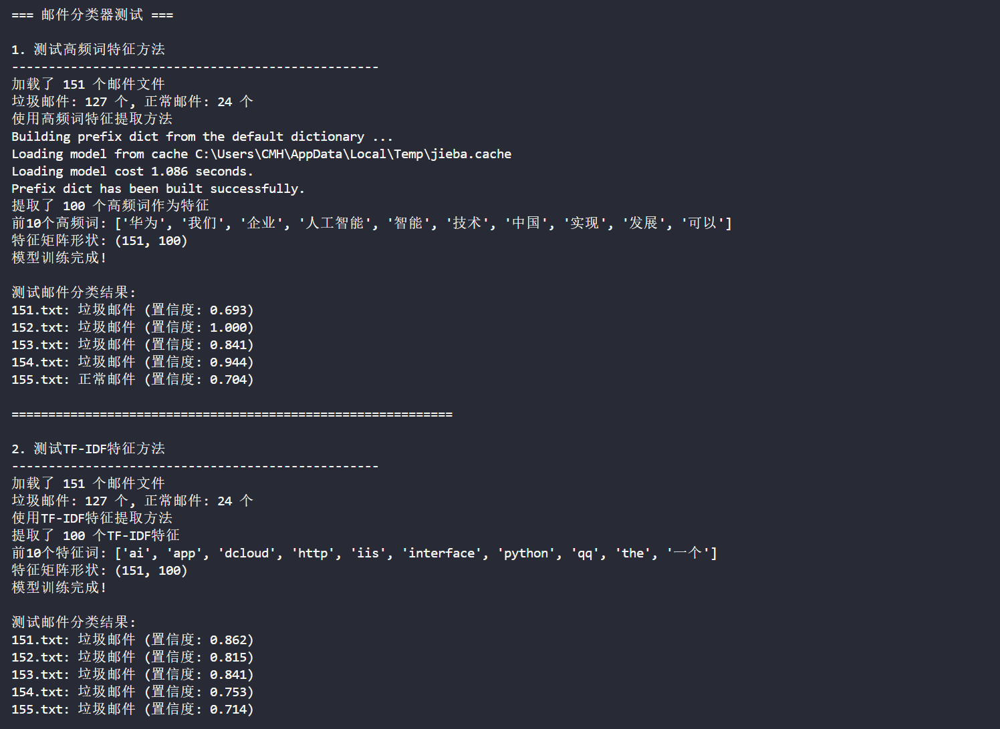

# 邮件分类器

## 概述

本模块实现了一个基于朴素贝叶斯的中文邮件分类器，用于区分垃圾邮件和正常邮件。支持两种特征提取方法：高频词特征和TF-IDF特征。

## 文件说明

- `classify.ipynb`: Jupyter笔记本实现，包含完整的数据处理和模型训练流程
- `email_classifier.py`: 模块化Python实现，支持参数化特征选择
- `邮件_files/`: 邮件数据集
  - `0.txt ~ 126.txt`: 垃圾邮件样本（127个）
  - `127.txt ~ 150.txt`: 正常邮件样本（24个）
- `image/`: 相关图片资源

## 核心算法

### 朴素贝叶斯分类器
采用多项式朴素贝叶斯算法，基于特征独立性假设进行概率计算：

```
P(垃圾邮件|特征) ∝ P(垃圾邮件) × ∏P(特征i|垃圾邮件)
P(正常邮件|特征) ∝ P(正常邮件) × ∏P(特征i|正常邮件)
```

### 特征提取方法

#### 1. 高频词特征
- 统计所有文档的词频
- 选择出现频率最高的N个词作为特征
- 构建词频向量进行分类

#### 2. TF-IDF特征
- 计算词的TF-IDF权重
- 考虑词在文档中的重要性和在语料库中的稀有性
- 提供更精确的特征表示

## 使用方法

### 方法一：使用Jupyter笔记本
```bash
jupyter notebook classify.ipynb
```

### 方法二：使用Python模块
```python
from email_classifier import EmailClassifier

# 高频词特征
classifier_freq = EmailClassifier(feature_method='freq', top_words_num=100)
classifier_freq.train()

# TF-IDF特征
classifier_tfidf = EmailClassifier(feature_method='tfidf', top_words_num=100)
classifier_tfidf.train()

# 预测
result, confidence = classifier.predict('邮件_files/test.txt')
print(f"分类结果: {result}, 置信度: {confidence:.3f}")
```

## 运行结果



## 数据处理流程

1. **文本预处理**：
   - 读取邮件文件内容
   - 过滤特殊字符和数字
   - 使用jieba进行中文分词
   - 去除长度为1的词

2. **特征构建**：
   - 高频词方法：统计词频，选择top-N词汇
   - TF-IDF方法：计算词汇的TF-IDF权重

3. **模型训练**：
   - 使用sklearn的MultinomialNB训练分类器
   - 基于特征向量和标签进行监督学习

4. **预测评估**：
   - 对新邮件进行特征提取
   - 使用训练好的模型进行分类预测
   - 输出分类结果和置信度
