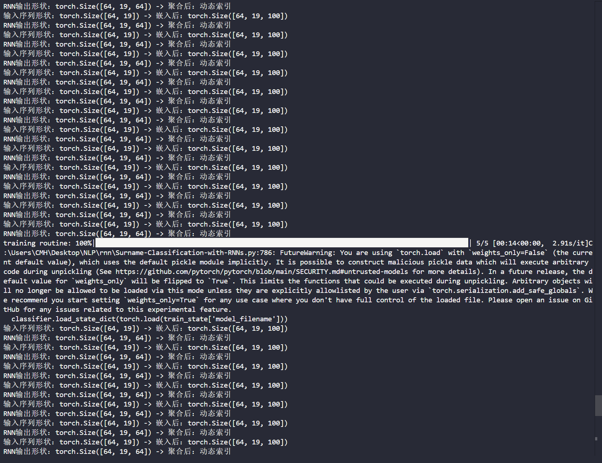
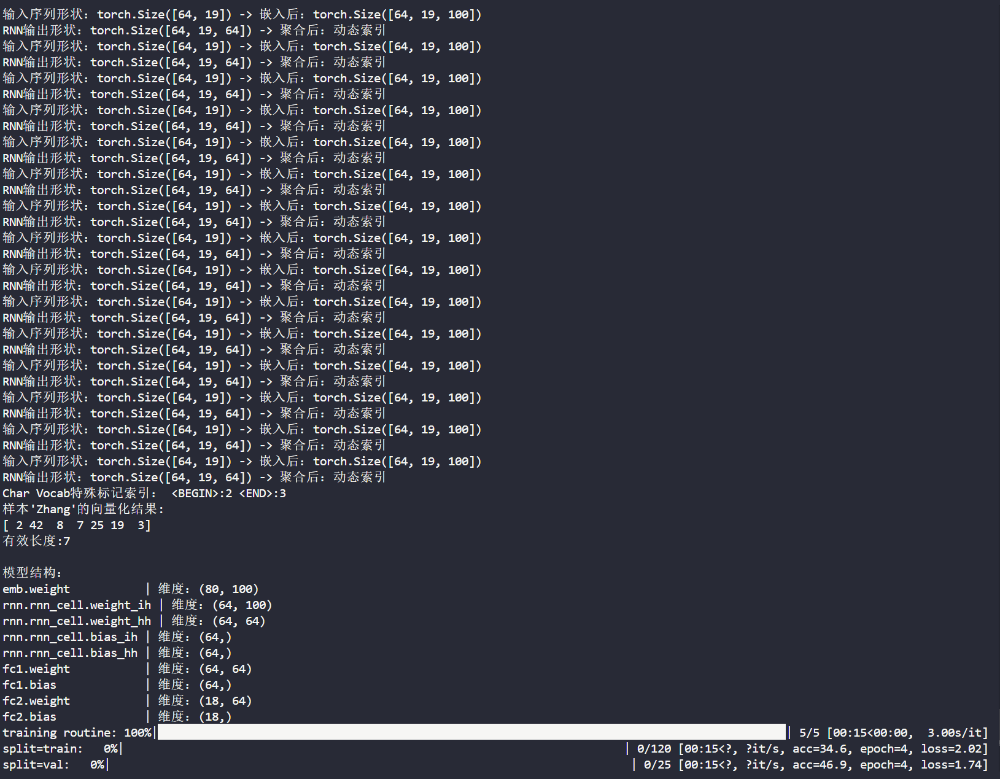
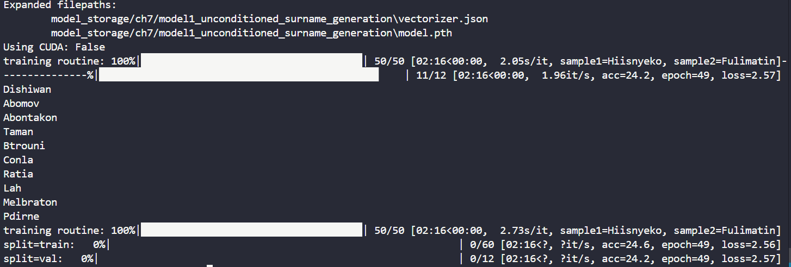
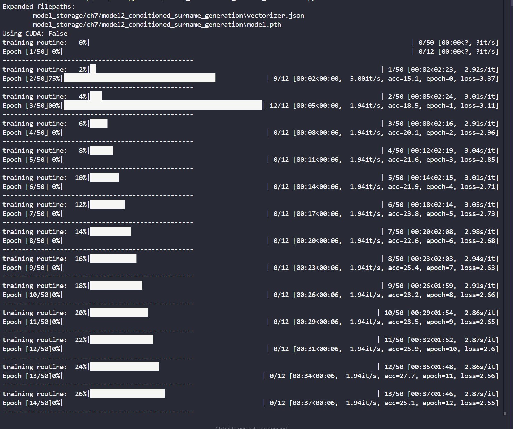
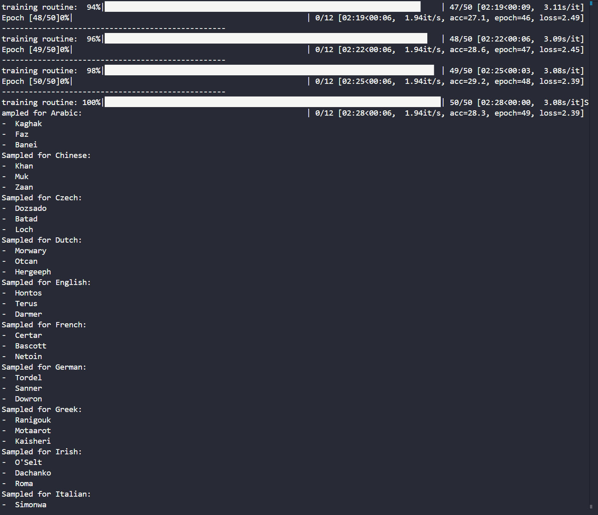
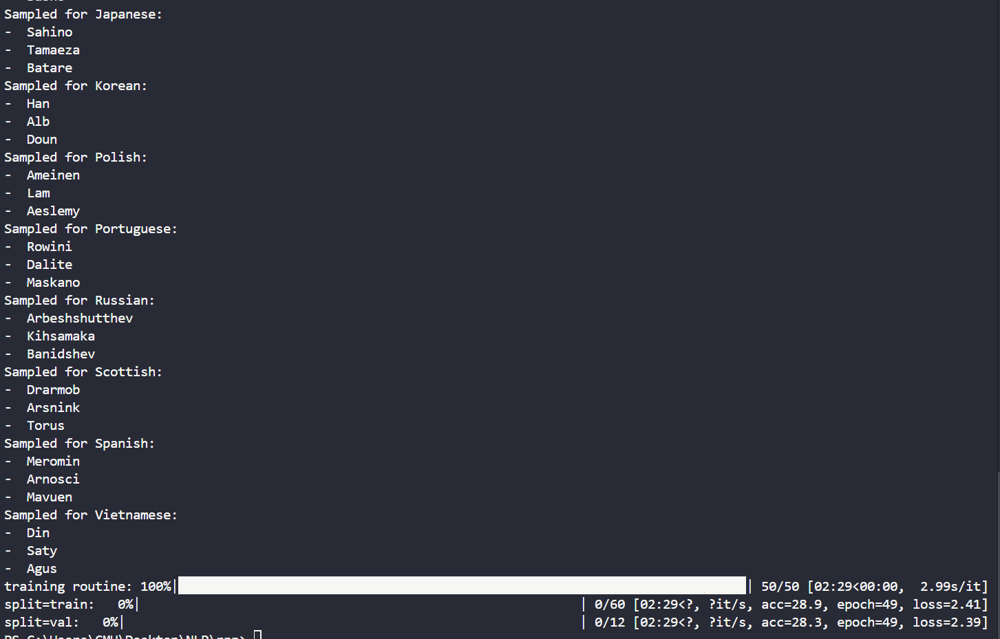

# RNN运行截图
## Surname-Classification-with-RNNs截图

## Model1_Unconditioned_Surname_Generation截图

## Model2_Conditioned_Surname_Generation截图

## 题目

### 两个模型的核心差异体现在什么机制上？

B. 是否考虑国家信息作为生成条件

### 在条件生成模型中，国家信息通过什么方式影响生成过程？

B. 作为GRU的初始隐藏状态

### 文件2中新增的nation_emb层的主要作用是：

B. 将国家标签转换为隐藏状态初始化向量

### 对比两个文件的sample_from_model函数，文件2新增了哪个关键参数？

B. nationalities